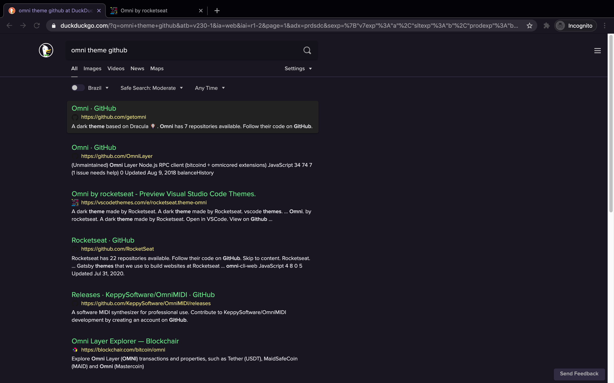
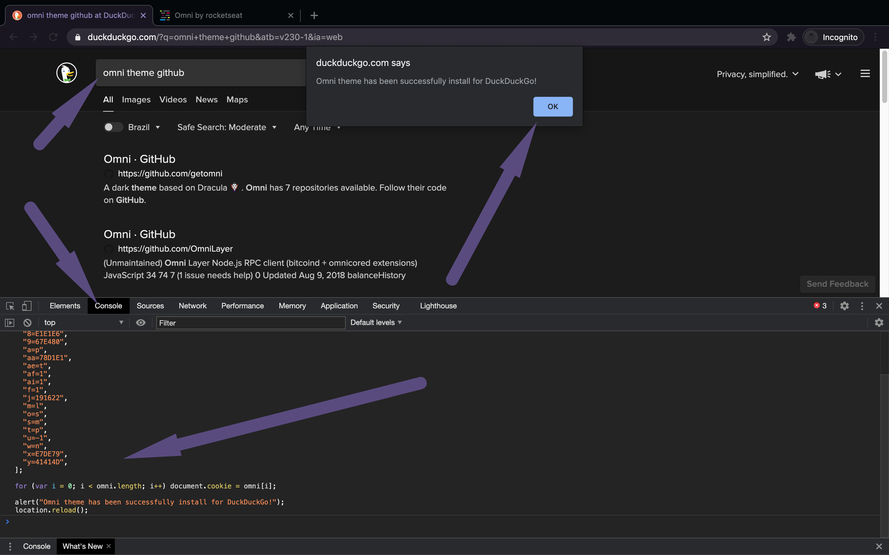

# Omni for [DuckDuckGo](https://duckduckgo.com)

> 🎨 Omni is everywhere [DuckDuckGo](https://duckduckgo.com)



## How does it work?

We can style DuckDuckGo by saving cookies in our browser. These can change colors,
font family and size, and content width. We can customize them further in the
[settting page](https://duckduckgo.com/settings#appearance).

## Installation Instructions

1.  Copy the text below:

```javascript
var omni = [
  "7=191622",
  "8=E1E1E6",
  "9=67E480",
  "a=p",
  "aa=78D1E1",
  "ae=t",
  "af=1",
  "ai=1",
  "f=1",
  "j=191622",
  "m=l",
  "o=s",
  "s=m",
  "t=p",
  "u=-1",
  "w=n",
  "x=E7DE79",
  "y=41414D",
];

for (var i = 0; i < omni.length; i++) document.cookie = omni[i];

alert("Omni theme has been successfully install for DuckDuckGo!");
location.reload();
```

2. Go to [DuckDuckGo](https://duckduckgo.com), open the javascript console and
   paste it there:



An alert with a success message should pop, reload your page and display the new
colors.
